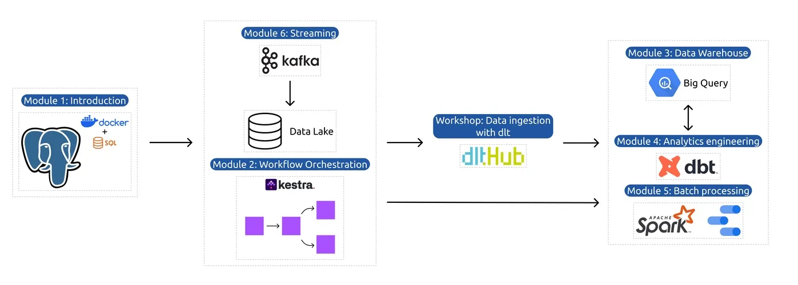

# **Data Engineering ZoomCamp 2025**

Welcome to my repository for the **Data Engineering ZoomCamp 2025**! This course is a comprehensive, hands-on program designed to cover the entire data engineering lifecycle. Over the weeks, I’ll build an **end-to-end data pipeline** while mastering tools and techniques essential for modern data engineering.

---

## **Course Modules**
This repository contains my work, notes, and assignments for the following course modules:

1. **Module 1: Containerization and Infrastructure as Code**
   - Tools: Docker, Terraform, GCP.
   - Set up infrastructure for data engineering pipelines.
2. **Module 2: Workflow Orchestration**
   - Tools: Kestra, Prefect, Airflow (optional).
   - Build workflows for scalable pipelines.
3. **Module 3: Data Warehouse**
   - Learn BigQuery and data warehousing concepts.
   - Optimize queries with partitioning and clustering.
4. **Module 4: Analytics Engineering** 
   - Tools: dbt (Data Build Tool), BigQuery, Looker Studio.
   - Transform raw data into analytical models.
5. **Module 5: Batch Processing** 
   - Explore Spark for large-scale data processing.
6. **Module 6: Streaming** 
   - Dive into real-time data streaming with Kafka.

---

## **Environment Setup**

### **Python Environment**
Create a virtual environment for Python libraries:

```bash
python3 -m venv DataEngVenv
source DataEngVenv/bin/activate
pip install -r requirements.txt
```

---

## **Repository Structure**

```
.
├── Images/                 # Screenshots and visual assets
├── Week01/                 # Module 1: Containerization and IaC
├── Week02/                 # Module 2: Workflow Orchestration
├── Week03/                 # Module 3: Data Warehousing
├── Week04/                 # Module 4: Analytics Engineering
├── .gitignore              # Ignored files
├── requirements.txt        # Python dependencies
└── README.md               # This file
```

---

## Infrastructure

Below is the architecture we’ll implement throughout the course, incorporating concepts from modules like containerization, workflow orchestration, data warehousing, analytics engineering, and batch/stream processing.


---

## My Notes

Find detailed notes for each week of the course on my Notion page: 🔗 [DataEng ZoomCamp 2025 Notes](https://spotted-hardhat-eea.notion.site/DataEng-ZoomCamp-2025-Notes-15729780dc4a8019a6d0d5ae204a9b07)


## **How to Use**
1. Clone the repository:
   ```bash
   git clone https://github.com/Horeb136/Data-Engineering-ZoomCamp-2025.git
   cd Data-Engineering-ZoomCamp-2025
   ```
2. Set up the environment as described above.
3. Explore the `WeekXX` folders for detailed exercises, workflows, and configurations.

---

## **My Progress**
- 📖 Week 01: **Completed**
- 📖 Week 02: **Completed**
- 📖 Week 03: **Completed**
- 🚀 Week 04: _In Progress_
- 🔜 Week 05: _Coming Soon_
- 🔜 Week 06: _Coming Soon_

---

## **Acknowledgments**
This repository is based on the **Data Engineering ZoomCamp**, a free course by [DataTalks.Club](https://datatalks.club). Many thanks to the instructors and contributors for creating such an incredible learning experience:
- **Victoria Perez Mola**
- **Alexey Grigorev**
- **Michael Shoemaker**
- **Zach Wilson**
- **Will Russell**
- **Anna Geller**

Check out the official [DataTalks.Club GitHub repository](https://github.com/DataTalksClub/data-engineering-zoomcamp) for more details about the course.

---

## **Community and Support**
Join the **DataTalks.Club Slack Community** for help, discussions, and updates. Don’t forget to follow the [community guidelines](https://datatalks.club/slack.html).

---

Feel free to suggest edits or provide feedback. I’m excited to continue this journey and learn more about data engineering!