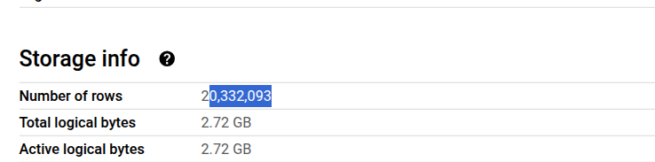

## Module 3 Homework

## Prerequisites 
- First of all, we've loaded the data Yellow Taxi Trip Records for **January 2024 - June 2024**
- Then, we're created an external table using the Yellow Taxi trip record with this commands : 
```sql
-- Creating an external table referring to GCS path
CREATE OR REPLACE EXTERNAL TABLE `PROJECT.DATASET.external_yellow_tripdata_2024`
OPTIONS (
  format = 'PARQUET',
  uris = ['gs://gold-yen-446410-g4-kestra-gcp-bucket/yellow_tripdata_2024-*.parquet']
);

-- Check external table data created 
SELECT *
FROM PROJECT.DATASET.external_yellow_tripdata_2024 
LIMIT 10 ;
```
- Create now a (regular/materialized) table in BQ using the Yellow Taxi Trip Records without partitioning or clustering
```sql
-- Create a non partitioned table from external table
CREATE OR REPLACE TABLE PROJECT.DATASET.yellow_tripdata_2024_non_partitioned AS
SELECT * 
FROM PROJECT.DATASET.external_yellow_tripdata_2024;
```

## Question 1:
Question 1: What is count of records for the 2024 Yellow Taxi Data?
- 65,623
- 840,402
- 20,332,093
- 85,431,289

### Answer 


Answer is : **20,332,093**

## Question 2:
Write a query to count the distinct number of PULocationIDs for the entire dataset on both the tables.</br> 
What is the **estimated amount** of data that will be read when this query is executed on the External Table and the Table?

- 18.82 MB for the External Table and 47.60 MB for the Materialized Table
- 0 MB for the External Table and 155.12 MB for the Materialized Table
- 2.14 GB for the External Table and 0MB for the Materialized Table
- 0 MB for the External Table and 0MB for the Materialized Table

### Answer 
**Code**
```sql
-- Count the distinct number of PULocationIDs in both table 
---- External one 
SELECT COUNT(DISTINCT PULocationID)
FROM PROJECT.DATASET.external_yellow_tripdata_2024 ;

---- The second one 
SELECT COUNT(DISTINCT PULocationID)
FROM PROJECT.DATASET.yellow_tripdata_2024_non_partitioned;

```

**0 MB for the External Table and 155.12 MB for the Materialized Table**


## Question 3:
Write a query to retrieve the PULocationID from the table (not the external table) in BigQuery. Now write a query to retrieve the PULocationID and DOLocationID on the same table. Why are the estimated number of Bytes different?
- BigQuery is a columnar database, and it only scans the specific columns requested in the query. Querying two columns (PULocationID, DOLocationID) requires 
reading more data than querying one column (PULocationID), leading to a higher estimated number of bytes processed.
- BigQuery duplicates data across multiple storage partitions, so selecting two columns instead of one requires scanning the table twice, 
doubling the estimated bytes processed.
- BigQuery automatically caches the first queried column, so adding a second column increases processing time but does not affect the estimated bytes scanned.
- When selecting multiple columns, BigQuery performs an implicit join operation between them, increasing the estimated bytes processed

### Answer 
**COde**
```sql
--- Retrieving columns
SELECT PULocationID
FROM PROJECT.DATASET.yellow_tripdata_2024_non_partitioned;

SELECT PULocationID, DOLocationID
FROM PROJECT.DATASET.yellow_tripdata_2024_non_partitioned;

```

**BigQuery is a columnar database, and it only scans the specific columns requested in the query. Querying two columns (PULocationID, DOLocationID) requires 
reading more data than querying one column (PULocationID), leading to a higher estimated number of bytes processed.**

## Question 4:
How many records have a fare_amount of 0?
- 128,210
- 546,578
- 20,188,016
- 8,333

### Answer 
**COde**
```sql
--- Number of records of fare_amountof 0
SELECT COUNT(fare_amount)
FROM PROJECT.DATASET.yellow_tripdata_2024_non_partitioned
WHERE fare_amount = 0;
```
Answer is : **8,333**

## Question 5:
What is the best strategy to make an optimized table in Big Query if your query will always filter based on tpep_dropoff_datetime and order the results by VendorID (Create a new table with this strategy)
- Partition by tpep_dropoff_datetime and Cluster on VendorID
- Cluster on by tpep_dropoff_datetime and Cluster on VendorID
- Cluster on tpep_dropoff_datetime Partition by VendorID
- Partition by tpep_dropoff_datetime and Partition by VendorID

### Answer 
**COde**
```sql
--- Number of records of fare_amountof 0
--- Partition then cluster 
CREATE OR REPLACE TABLE `PROJECT.DATASET.optimized_yellow_tripdata_2024`
PARTITION BY DATE(tpep_dropoff_datetime)
CLUSTER BY VendorID AS
SELECT *
FROM `PROJECT.DATASET.yellow_tripdata_2024_non_partitioned`;
```
Answer is : **Partition by tpep_dropoff_datetime and Cluster on VendorID**

## Question 6:
Write a query to retrieve the distinct VendorIDs between tpep_dropoff_datetime
2024-03-01 and 2024-03-15 (inclusive)</br>

Use the materialized table you created earlier in your from clause and note the estimated bytes. Now change the table in the from clause to the partitioned table you created for question 5 and note the estimated bytes processed. What are these values? </br>

Choose the answer which most closely matches.</br> 

- 12.47 MB for non-partitioned table and 326.42 MB for the partitioned table
- 310.24 MB for non-partitioned table and 26.84 MB for the partitioned table
- 5.87 MB for non-partitioned table and 0 MB for the partitioned table
- 310.31 MB for non-partitioned table and 285.64 MB for the partitioned table

### Answer 
**COde**
```sql
--- Retrieving the distinct VendorIDs between tpep_dropoff_datetime 2024-03-01 and 2024-03-15 (inclusive)
-----Materialized table 
SELECT DISTINCT VendorID
FROM PROJECT.DATASET.yellow_tripdata_2024_non_partitioned
WHERE DATE(tpep_dropoff_datetime) BETWEEN "2024-03-01" AND "2024-03-15";

----- Optimized table
SELECT DISTINCT VendorID
FROM PROJECT.DATASET.optimized_yellow_tripdata_2024
WHERE DATE(tpep_dropoff_datetime) BETWEEN "2024-03-01" AND "2024-03-15";
```
Answer is : **310.24 MB for non-partitioned table and 26.84 MB for the partitioned table**

## Question 7: 
Where is the data stored in the External Table you created?

- Big Query
- Container Registry
- GCP Bucket
- Big Table

### Answer 

Answer is : **GCP Bucket**

## Question 8:
It is best practice in Big Query to always cluster your data:
- True
- False

### Answer 

Answer is : **False**


## (Bonus: Not worth points) Question 9:
No Points: Write a `SELECT count(*)` query FROM the materialized table you created. How many bytes does it estimate will be read? Why?

### Answer 
```sql
--- Bonus
SELECT COUNT(*) 
FROM gold-yen-446410-g4.kestra_gcp_dataset.yellow_tripdata_2024_non_partitioned;

```
It estimates 0kb. That's because **COUNT(*)** query in BigQuery does not scan all columns, only the metadata 